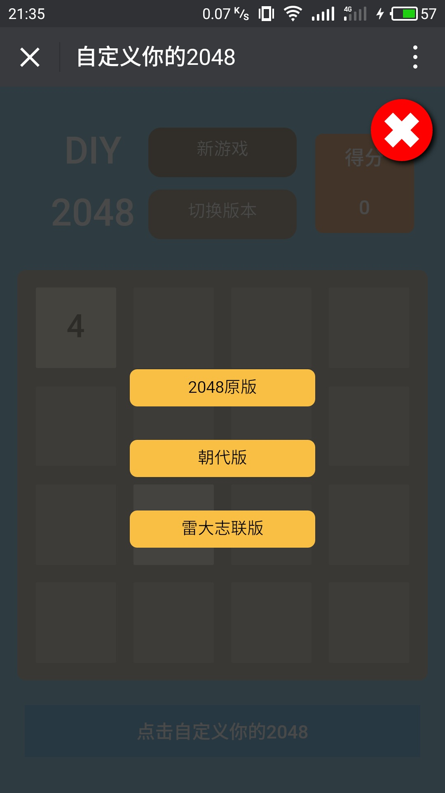

## DIY 2048
2048游戏是前几年比较火一款游戏。游戏规则比较简单，就是滑动小方块使两个有相同数字（内容）的小方块合并成一个新小方块，直到小方块不能再移动为止。突发奇想想自己做个这样一款游戏，就在网上找课程来学，在这基础上添加自己想要的功能。

## 如何玩本款2048游戏
### 进入游戏
首先，通过以下两种方式访问游戏：
- 游戏链接：[进入游戏](https://liaozeen.github.io/my2048/)

- 扫描二维码进入

### 游戏规则
 - 通过方向键或手指滑动控制小方块的移动方向
 - 移动方块使两个有相同数字（内容）的方块合并成一个新的更大值的方块
 - 每合成一个新的方块，就获得加分。
 - 加分规则：增加的分值为新方块的数值，如4和4合并成8，就加8分

### 游戏功能
#### 1.点击左上角的【DIY 2048】可自由切换日夜间模式
日间模式（默认）

夜间模式

#### 2.点击【新游戏】，重新开始游戏
#### 3.点击【切换版本】，可选择其他版本玩

朝代版

雷大志联（全称：[雷州市大学生志愿者联合会](http://mp.weixin.qq.com/s?__biz=MzA4NjQ3MTgwOA==&mid=200123656&idx=1&sn=075ae2bd544cfd4734e22f90f0f78f2d&mpshare=1&scene=23&srcid=0818uu8LdP1uAz4QxIQ4v4WL#rd)）是一个地域性的大学生公益组织，在大学期间的大部分时间都贡献给这个组织。所以，特意做了这个版本，留个念想。

#### 点击【点击自定义你的2048】，可自己设计2048的内容

### 学习资源
- [慕课网2048私人定制](http://www.imooc.com/learn/76)
- [10款精美而实用的HTML5表单](http://www.html5tricks.com/10-html5-form-login-contact-search-form.html)
- [jQuery官网](https://jquery.com/)
- 游戏中用到的jQuery的方法
  + [jQuery属性操作-css()方法](http://www.w3school.com.cn/jquery/jquery_css.asp)
  + [jQuery属性操作-val()方法](http://www.w3school.com.cn/jquery/attributes_val.asp)
  + [jQuery事件-click()方法](http://www.w3school.com.cn/jquery/event_click.asp)
  + [jQuery事件-keydown()方法](http://www.w3school.com.cn/jquery/event_keydown.asp)
  + [jQuery事件-preventDefault()方法](http://www.w3school.com.cn/jquery/event_preventdefault.asp)
  + [jQuery文档操作-append()方法](http://www.w3school.com.cn/jquery/manipulation_append.asp)
  + [jQuery文档操作-text()方法](http://www.w3school.com.cn/jquery/manipulation_text.asp)
  + [jQuery效果-animate()方法](http://www.w3school.com.cn/jquery/manipulation_text.asp)
- [JavaScript Math 对象](http://www.w3school.com.cn/jsref/jsref_obj_math.asp)
- [计时器setTimeout()方法](http://www.w3school.com.cn/jsref/met_win_settimeout.asp)
- [使用javascript为网页增加夜间模式](http://www.jb51.net/article/46223.html)